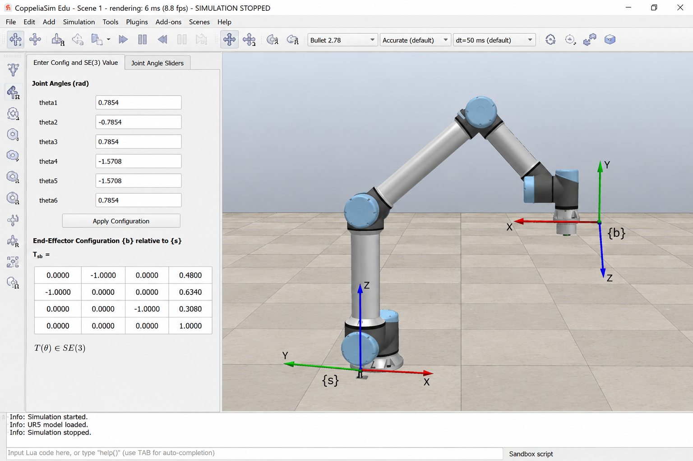

# UR5 Forward Kinematics (CoppeliaSim)

A small project from my Modern Robotics course (Northwestern, via Coursera). I simulated a 6-axis UR5 arm and worked out where its hand ends up for a given set of joint angles.

## What it does
- Takes 6 joint angles (in radians)
- Computes the end-effector pose as a 4x4 matrix
- Lets me compare the result with what CoppeliaSim shows

## Joint angles I used
`0.7854, -0.7854, 0.7854, -1.5708, -1.5708, 0.7854`

## Result
The simulator gave an end-effector position of about (0.480, 0.634, 0.308) metres.



## Run it
```
pip install numpy modern_robotics
python fk_ur5.py
```

## What I learned
- One 4x4 matrix can hold both position and rotation
- Forward kinematics is just multiplying one small transformation per joint
- Checking my own code against a simulator caught mistakes early

## License
MIT
